# IOS抓包教程

## 程序准备

::: info
此教程步骤符合绝大部分抓包软件，该教程以`Reqable`为例
:::

在App Store搜索`Reqable`或 [点此跳转](https://apps.apple.com/cn/app/reqable/id6473166828)

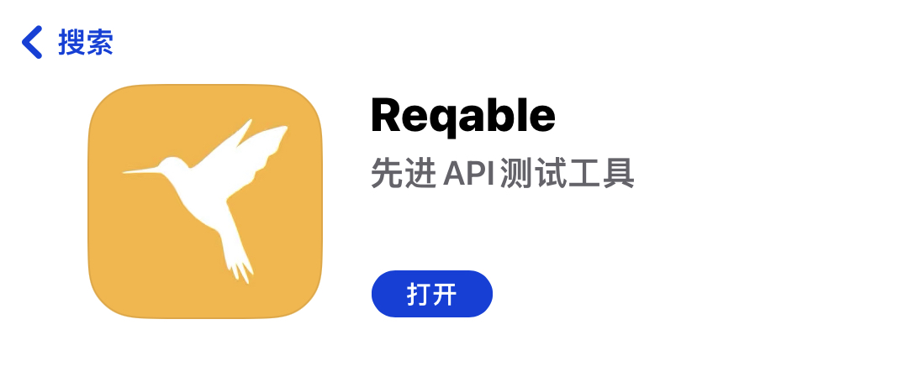

安装成功后打开，同意用户协议，接下来会提示选择工作模式，为方便故选择`独立模式`

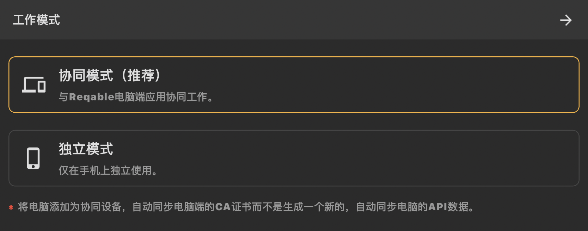

::: info
- 独立模式：抓包信息显示并保存到本地
- 协同模式：与电脑端连接，抓包信息显示在电脑端可从电脑端保存
- **注意两个模式的证书是不同的，若切换模式需重新安装证书**
:::

## 安装证书

选择模式后会发现调试界面目前空白，点击左上角的三条杠，选择`证书管理`

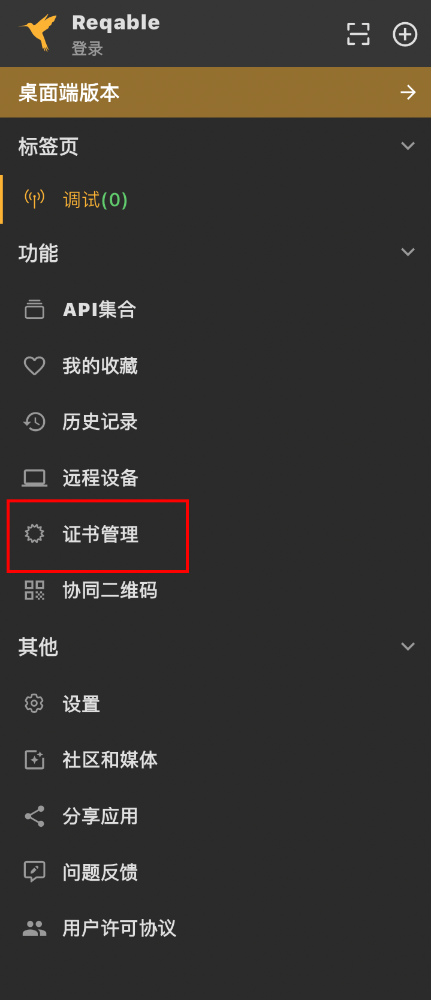

点击证书管理后会发现*证书未安装*的字样，选择`安装根证书到本机`

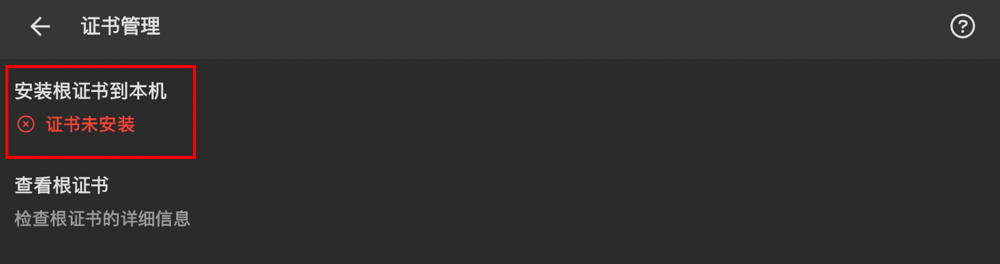

进入后，点击方法2的`下载`字样，之后会提示保存，选择完成即可

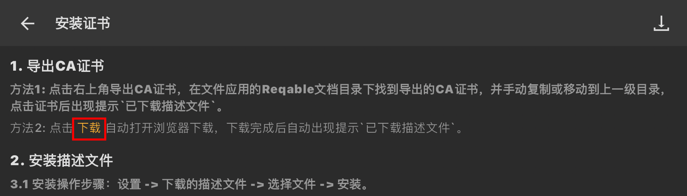

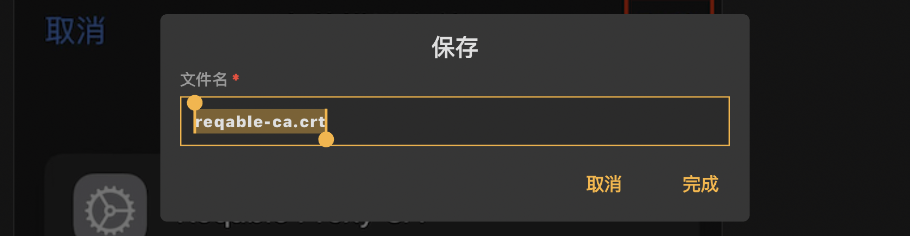

软件会自动跳转到浏览器，点击`允许`即可

安装完成后，打开设置，选择iCloud账号位置下的已下载描述文件 或 找到`通用`->`VPN与设备管理`，点击已下载的描述文件的`Reqable Root CA (xxxxxx)`,选择`安装`即可

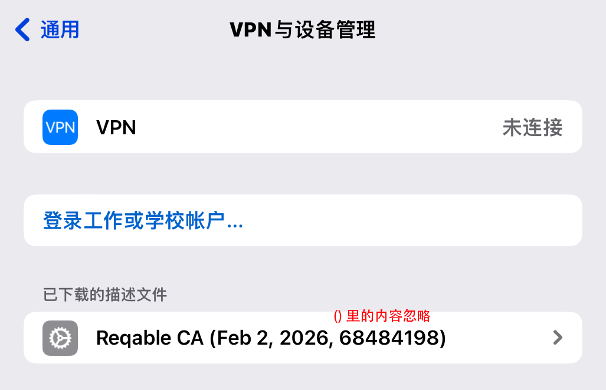

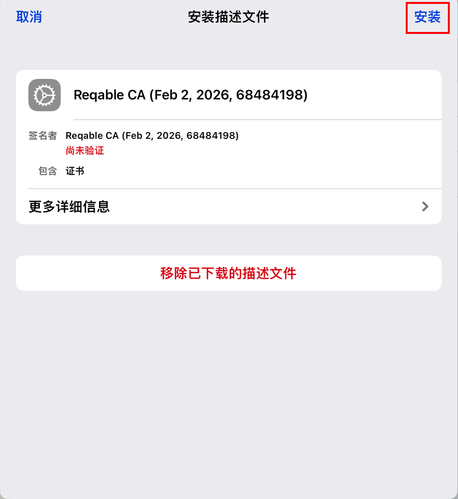

输入完锁屏密码后，再次点击`安装`即可完成安装，当出现已安装描述文件即安装成功

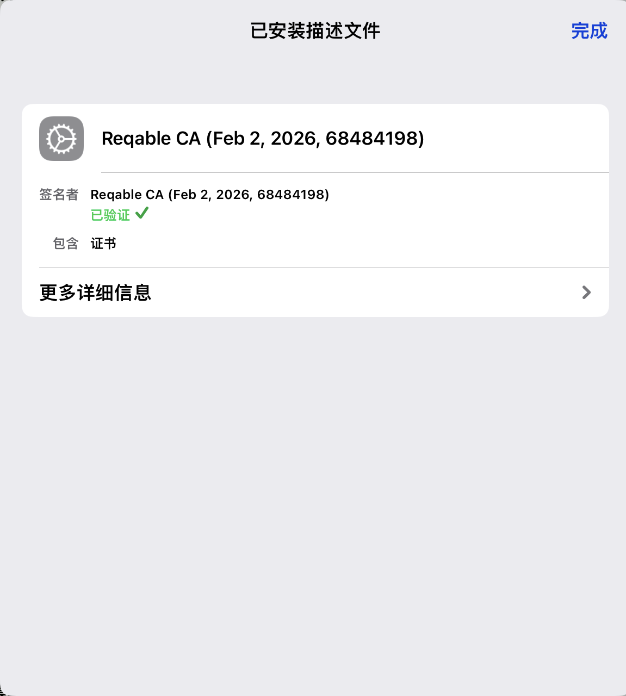

接着返回`通用`->`关于本机`，点击`证书信任设置`，找到`Reqable Root CA (xxxxxx)`，打开开关，选择继续

最后，打开Reqable证书管理，当显示证书已安装时则安装成功

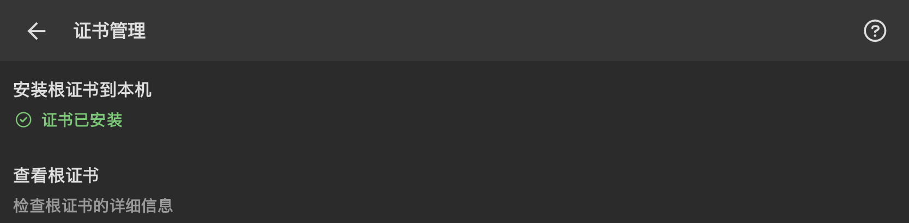

::: info 
Q: 安装证书后仍然提示证书未安装   
A: 检查Reqable`查看根证书`下的`常用名称`是否与已信任的证书名一致，若不一致则需要重新安装证书   
Q: 跳转到浏览器后提示无法连接服务器   
A: 重启Reqable后重试，若仍提示无法连接服务器则在`证书管理`下选择`重新生成根证书`，并再次安装证书   
:::

## 抓取Suite

安装完证书后，打开Reqable，点击右下角的纸飞机按钮，第一次启动时会提示添加VPN配置，点击`允许`后输入锁屏密码，出现VPN标识即开始抓包

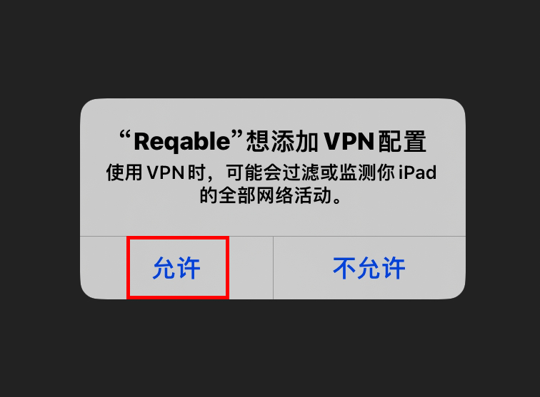

进入游戏后，若出现如图错误

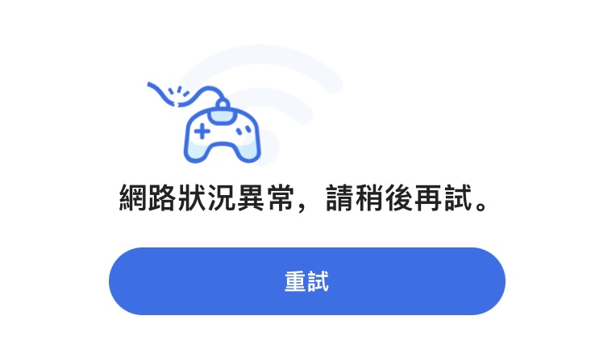

请先关闭Reqable，当出现Loading后，再次打开Reqable抓包即可

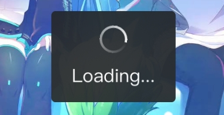

问题解决后，就可以进入游戏了，当游戏加载完成后，即可关闭游戏

现在回到Reqable，你会发现有大量的网址域名，点击右上角的更多选择搜索

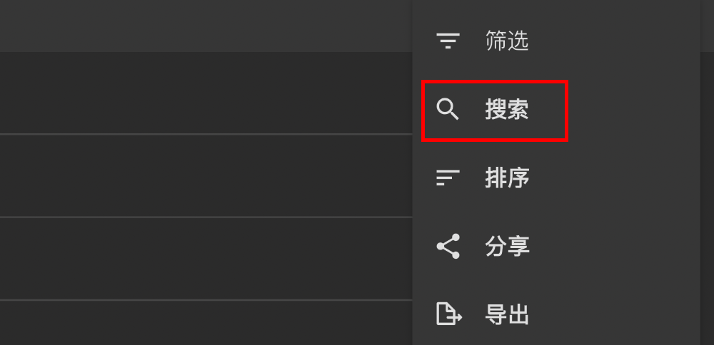

在弹出的搜索框中输入Suite，会出现一个结果

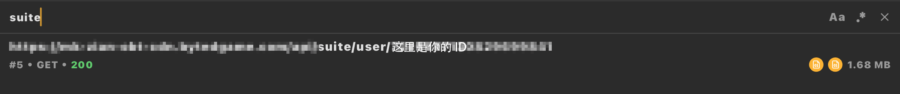

点击查看，选择`响应`->`响应体`，点击下载按钮进行保存

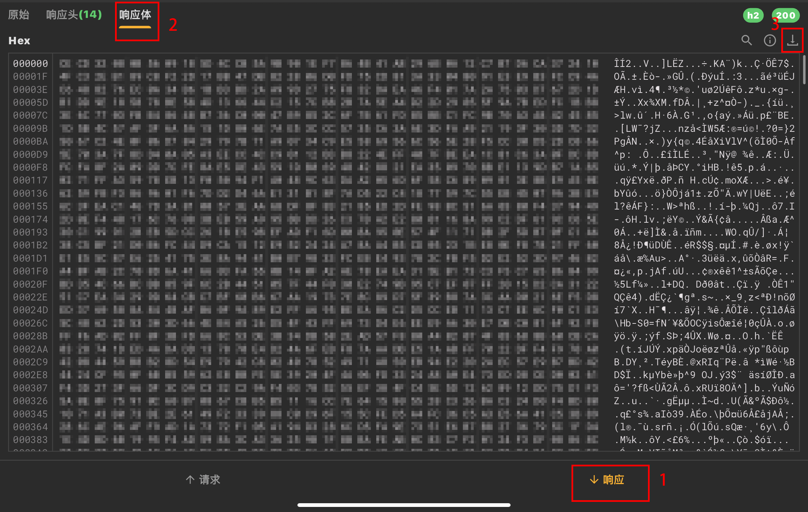

保存后打开IOS的`文件`，找到Reqable文件夹

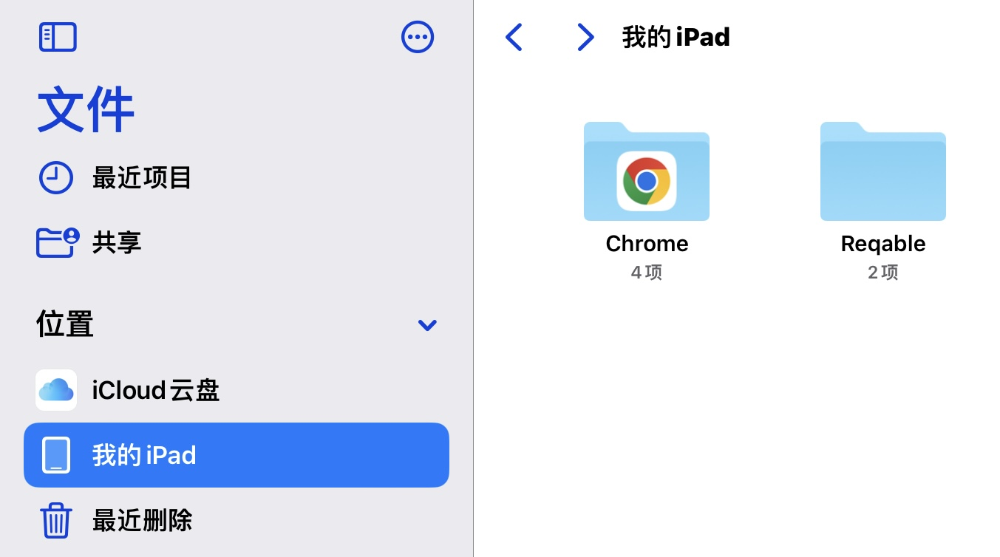

一般里面名字为`你的游戏ID`的文件就是Suite文件，接下来你就可以选择发送到电脑或者直接上传到相应的查分工具

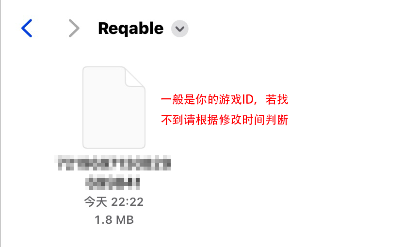

## 抓取MySekai

::: info
同上类似操作，不多阐述
:::

