# 安卓模拟器抓包教程
::: info
因安卓进行证书安装需要root权限，且目前手机root门槛较高，本教程介绍以日服为例如何在模拟器下操作
:::
## 程序准备
(点击蓝色文字可跳转)
- [mumu模拟器](https://mumu.163.com)
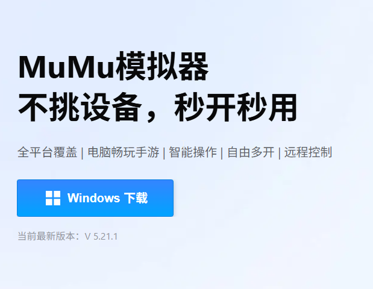
- [Reqable](https://reqable.com)(PC端与安卓端都需要安装)
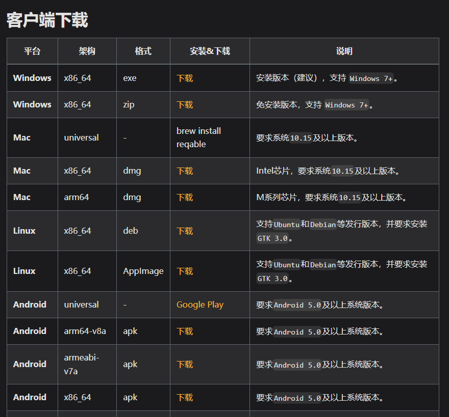
选择对应版本安装，若下载安卓版本时不清楚架构，可选择`armeabi-v7a`架构
- [RE文件管理器](https://mumu.163.com/games/24041.html)

### mumu模拟器
#### 开启root权限
安装完成后，点击右上的`更多` -> `设备设置` -> `其他` -> 将`root权限`设为开启

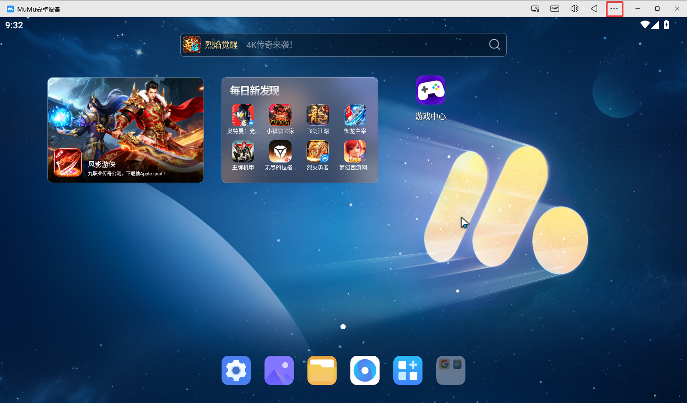

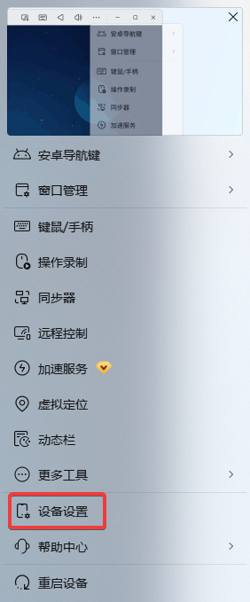

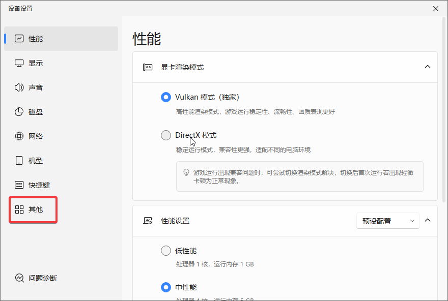

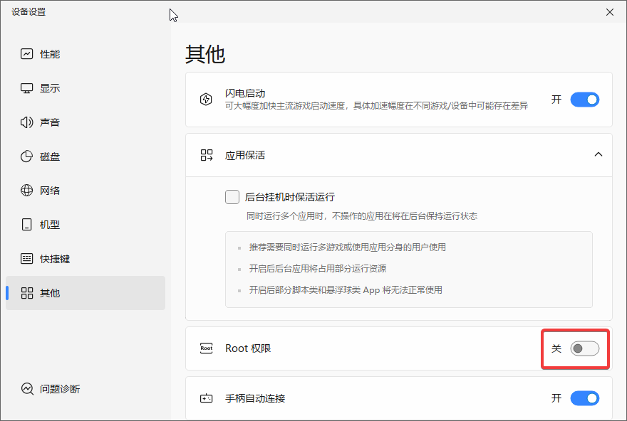

#### 开启系统盘读写权限
开启root权限后选择`磁盘` -> `磁盘共享` -> 设置为`可写系统盘`

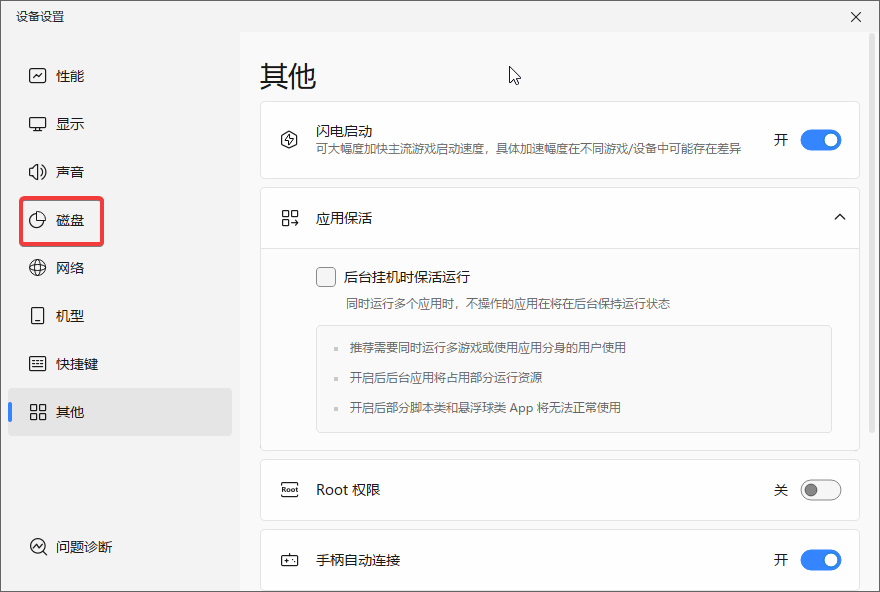

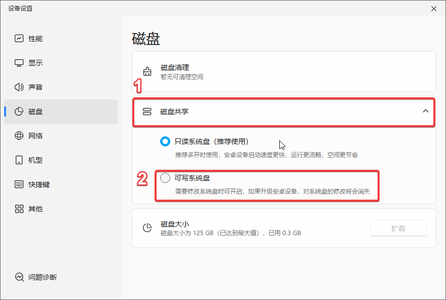

设置完成后，会提示重启模拟器，点击`重启`即可

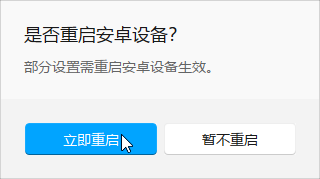

#### 安装RE管理器与谷歌框架
打开桌面上的小工具文件夹，点击两图标可将`RE文件管理器`与`谷歌安装器`安装到模拟器

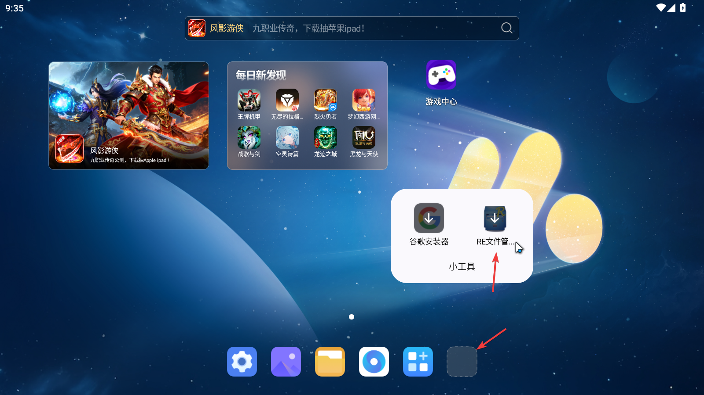

##### 谷歌框架
打开软件，点击`一键下载`，等待安装完成即可

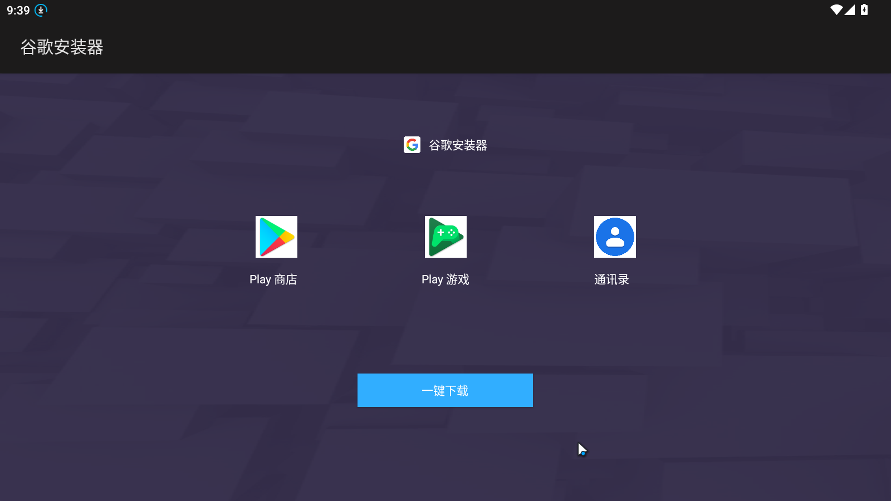

### 游戏下载
外服可以从[QooApp商店](https://apps.qoo-app.com/app/9038)下载，初次打开在其他通行方式选择`Guest`再选择`直接进入QooApp`就可免登录

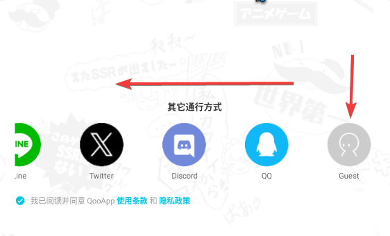

### Reqable
#### PC端
安装完成后，打开软件，工作模式选择`API抓包`，并点击`完成`

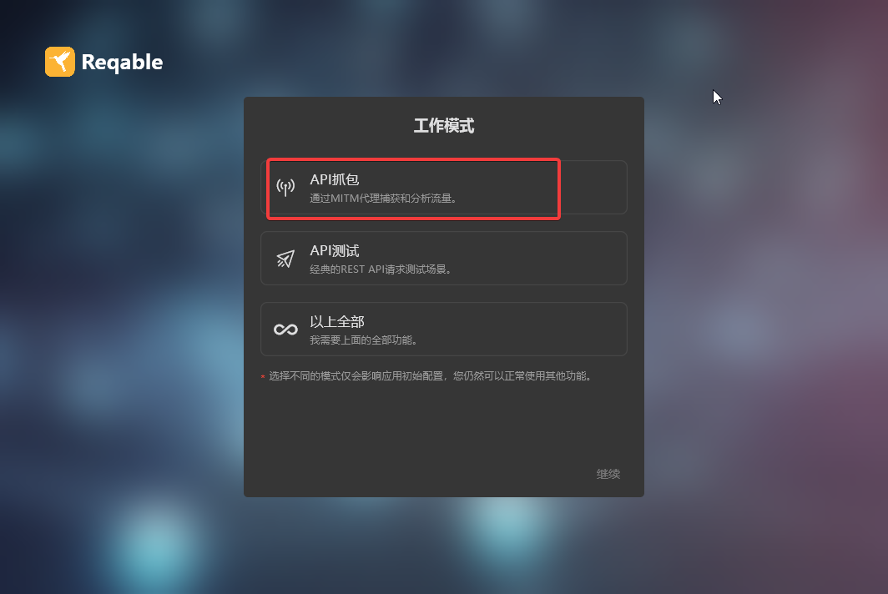

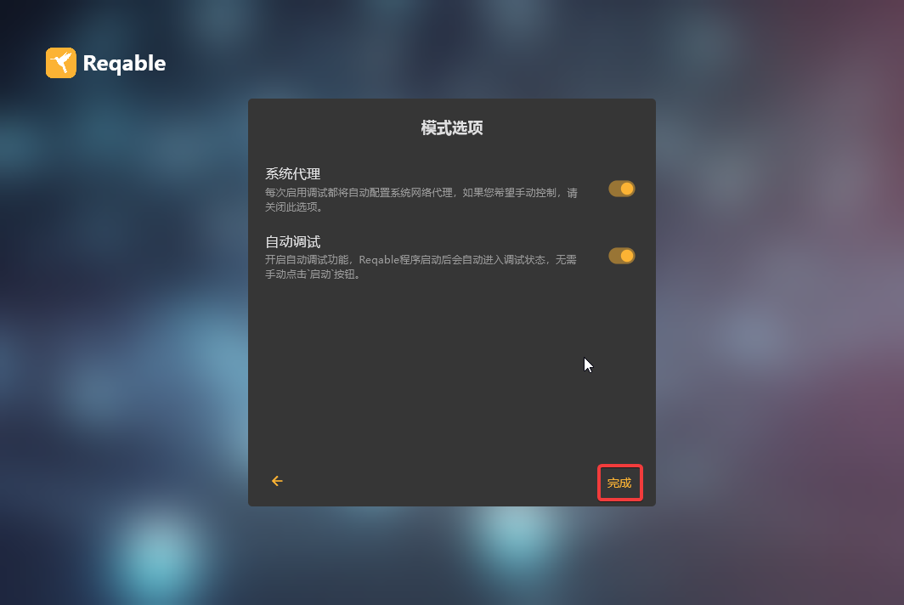

进入后点击如图按钮备用

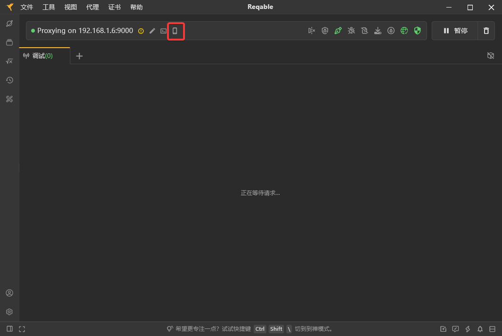

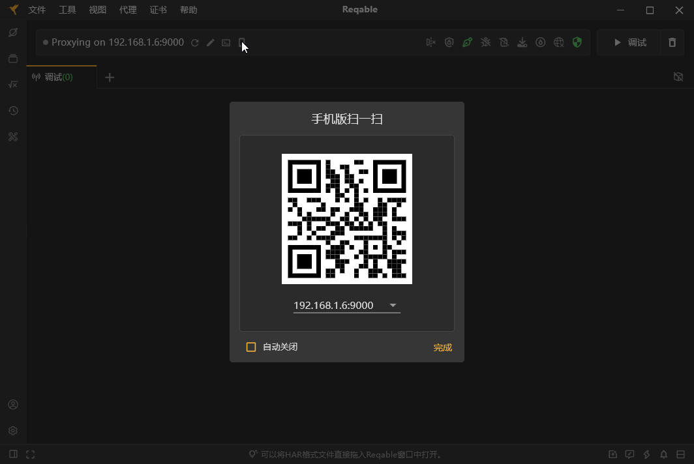

#### 安卓端
安装完成后，打开软件，工作模式选择`协同模式`，并点击右上角扫描标志

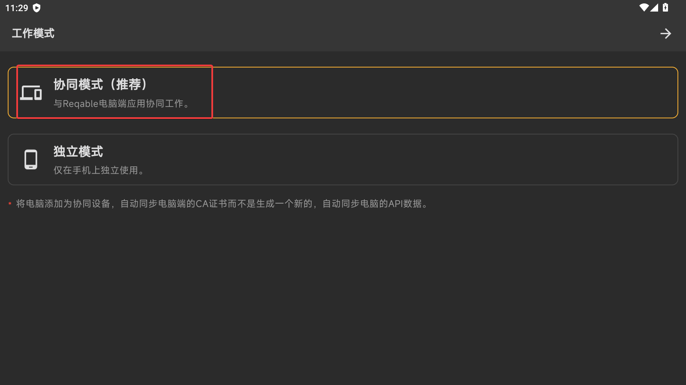

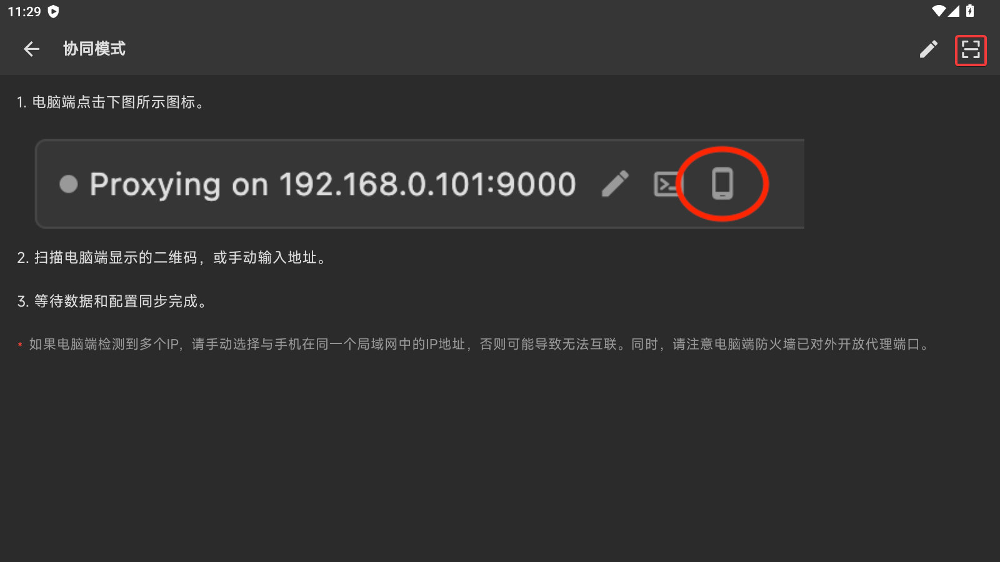

这时我们需要使用模拟器的虚拟摄像头进行扫码与电脑端连接，点击`实时截屏`

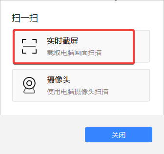

会出现一个窗口，将窗口拖动覆盖到二维码上，软件就会自动识别并连接到电脑端，当显示`已连接`时即连接成功

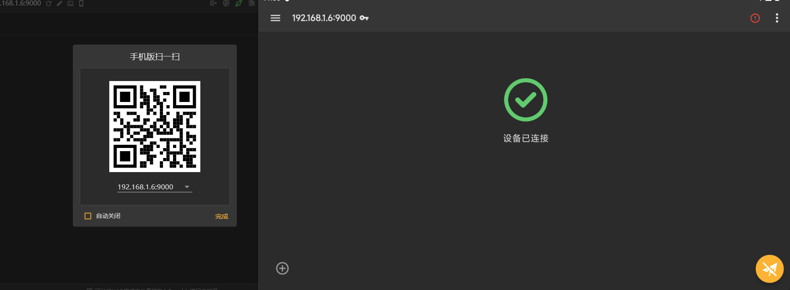

## 安装证书

## 登陆游戏（日服与国际服）

## 抓取Suite

## 抓取MySekai

::: info
同上类似操作，不多阐述 
:::

