# 安卓模拟器抓包教程
::: info
因安卓进行证书安装需要root权限，且目前手机root门槛较高，本教程介绍以日服为例如何在模拟器下操作
:::
:::warning
国服无法通过模拟器检测，可以尝试通过mac版mumu模拟器或者Linux上的arm模拟模式绕过
:::
## 程序准备
(点击蓝色文字可跳转)
- [mumu模拟器](https://mumu.163.com)

- [Reqable](https://reqable.com)(PC端与安卓端都需要安装)

选择对应版本安装，若下载安卓版本时不清楚架构，可选择`armeabi-v7a`架构
- [RE文件管理器](https://mumu.163.com/games/24041.html)

### mumu模拟器
#### 开启root权限
安装完成后，点击右上的`更多` -> `设备设置` -> `其他` -> 将`root权限`设为开启


#### 开启系统盘读写权限
开启root权限后选择`磁盘` -> `磁盘共享` -> 设置为`可写系统盘`


设置完成后，会提示重启模拟器，点击`重启`即可


#### 安装RE管理器与谷歌框架
打开桌面上的小工具文件夹，点击两图标可将`RE文件管理器`与`谷歌安装器`安装到模拟器


##### 谷歌框架
打开软件，点击`一键下载`，等待安装完成即可


### 游戏下载
外服可以从[QooApp商店](https://apps.qoo-app.com/app/9038)下载，初次打开在其他通行方式选择`Guest`再选择`直接进入QooApp`就可免登录


### Reqable
#### PC端
安装完成后，打开软件，工作模式选择`API抓包`，并点击`完成`


进入后点击如图按钮备用


#### 安卓端
安装完成后，打开软件，工作模式选择`协同模式`，并点击右上角扫描标志


这时我们需要使用模拟器的虚拟摄像头进行扫码与电脑端连接，点击`实时截屏`


会出现一个窗口，将窗口拖动覆盖到二维码上，软件就会自动识别并连接到电脑端，当显示`已连接`时即连接成功


## 安装证书


## 通过引继码方式登陆游戏账号（日服与国际服）
### 原设备
进入游戏后，点击更多菜单的如图所示标志
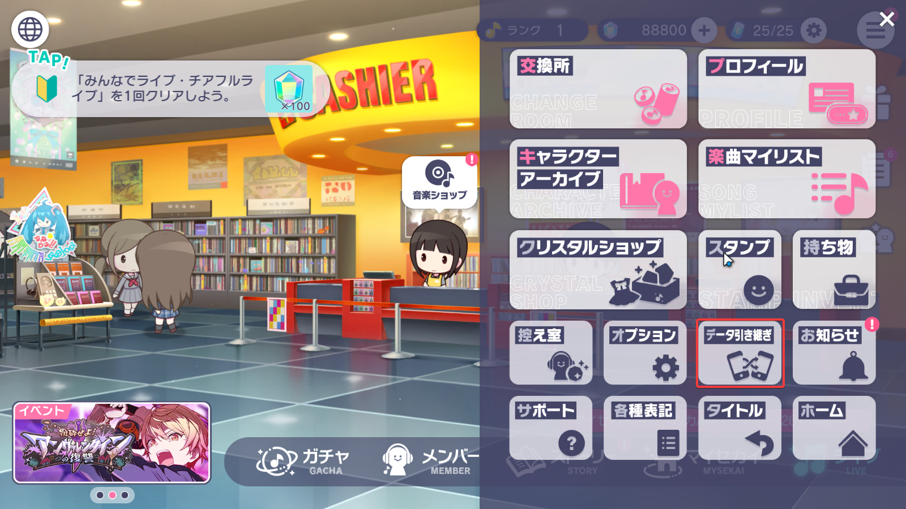
选择```
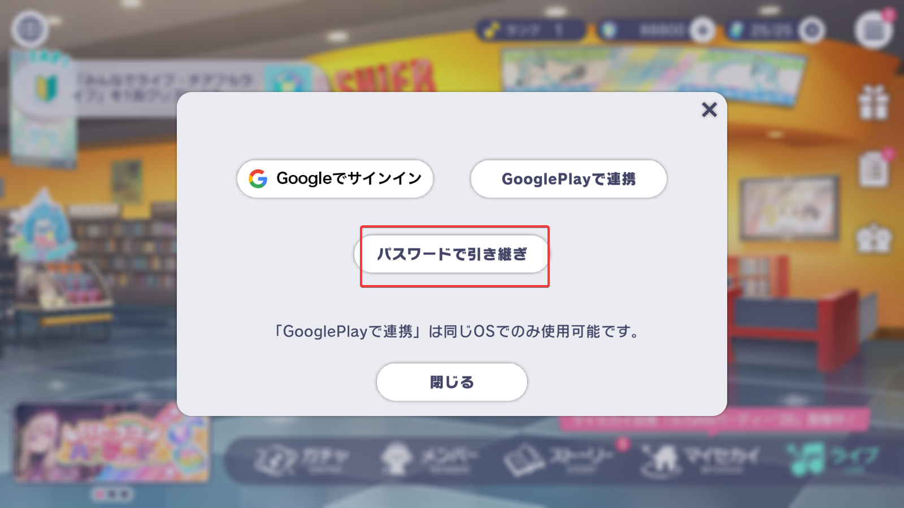
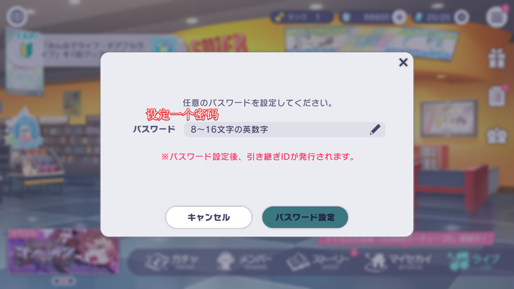
设置密码后，会提示你再次确认引继账号，确认无误后引继码即生成完毕
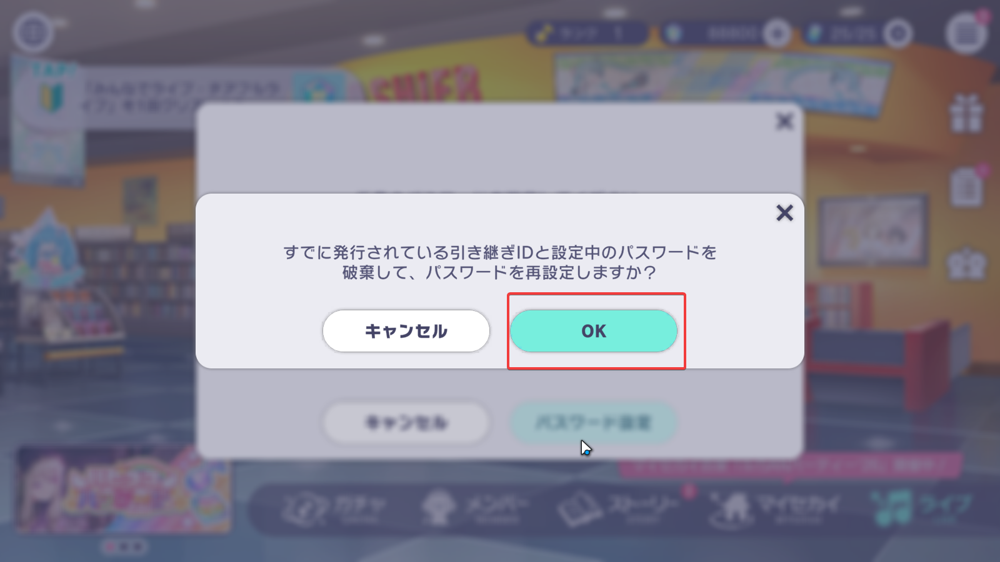
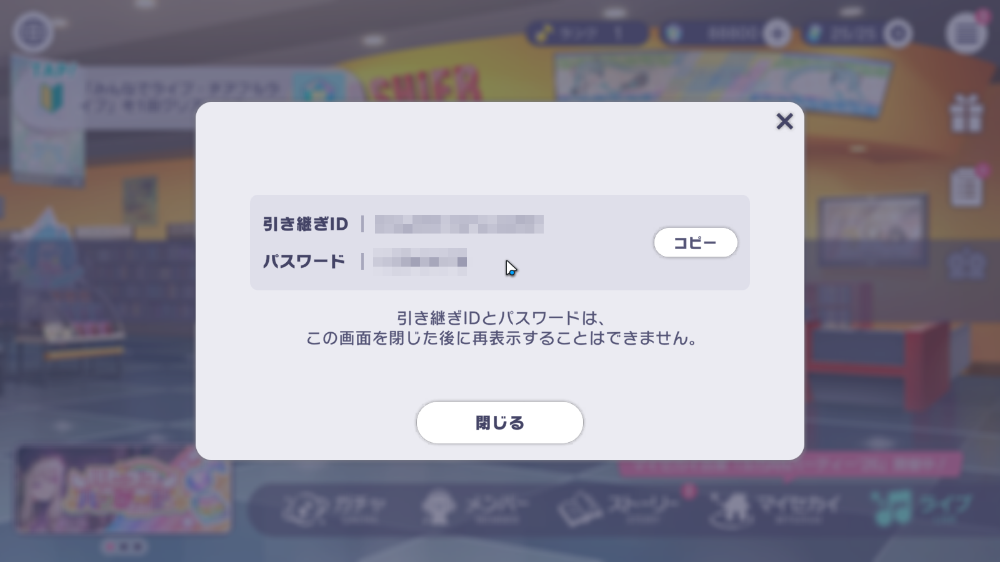

::: info
如果忘记引继码可以重复以上步骤重新生成，引继码只有最后一个生成的有效
:::

### 模拟器
如果进入游戏出现如下画面且迟迟未变化时，点击右上角返回退出
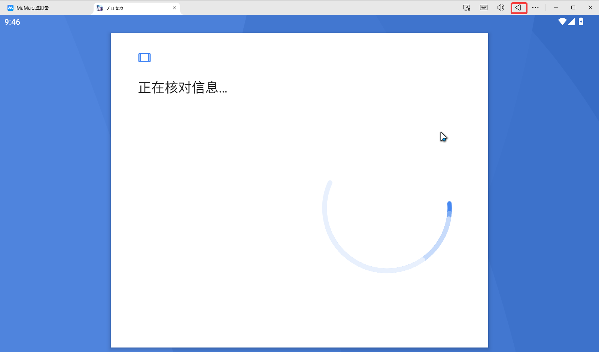
进入游戏后，按照图上步骤进入引继界面

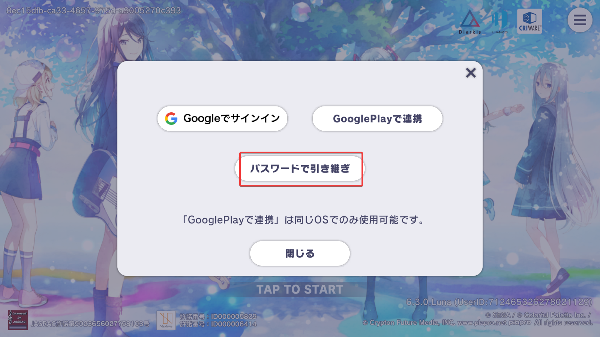

进入如下界面时请输入之前原设备生成的引继码和设置的密码并点击`引き継ぎ`
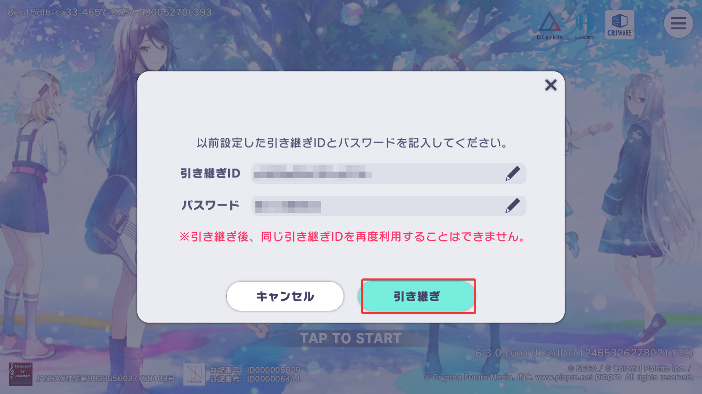
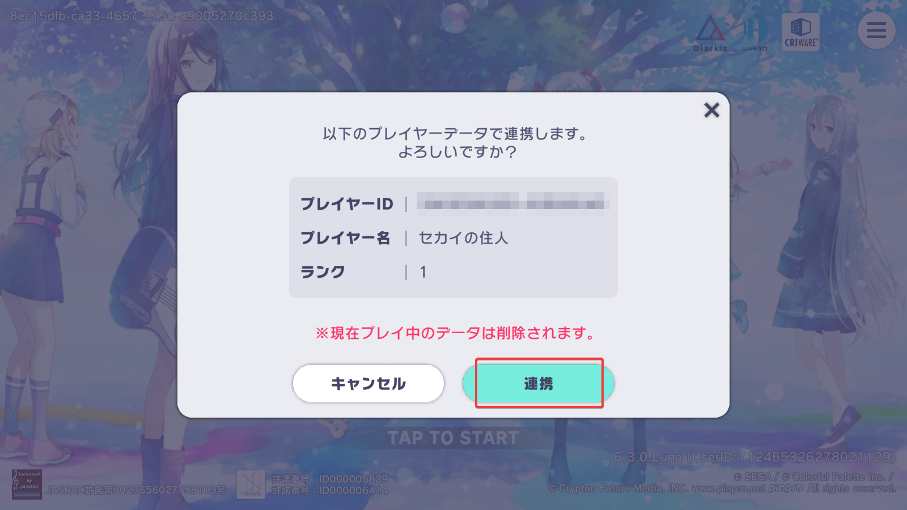

出现如下提示时就代表已经完成引继，如果要在原设备重新登录则像以上步骤重新引继即可
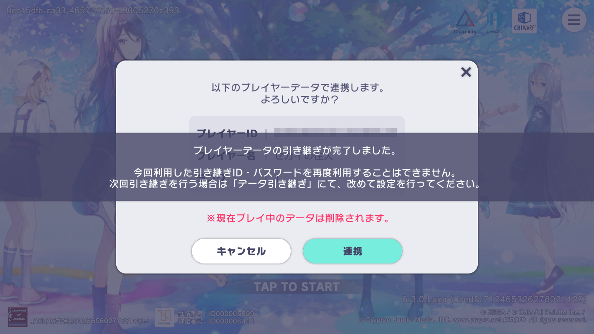

## 抓取Suite
打开电脑和模拟器的Reqable，按照如下操作启动代理
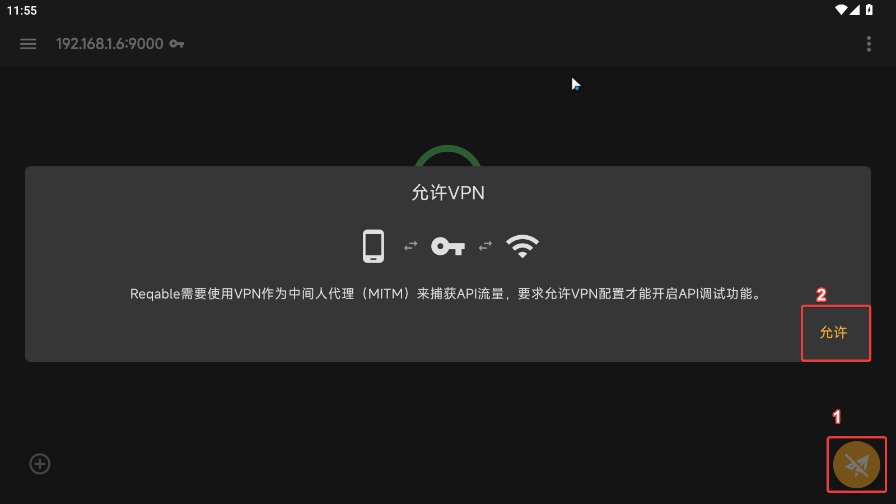
回到电脑端，按照如下操作过滤抓包信息，若除了`本机`没有任何设备则是模拟器没有正确连接到电脑，检查一下标签页是否切换到电脑，以及证书是否安装成功
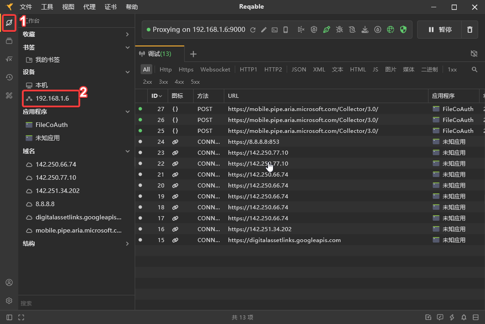

## 抓取MySekai

::: info
同上类似操作，不多阐述 
:::


