# Windows 本地部署

::: info
如果机器人已经部署，将插件拖入插件文件夹，安装requirements.txt中的依赖即可
:::

## Napcat 部署
前往[ NapCatQQ 的 Releases 页面 ](https://github.com/NapNeko/NapCatQQ/releases)下载最新`NapCat.Shell.Windows.OneKey.zip`版本，解压到任意目录

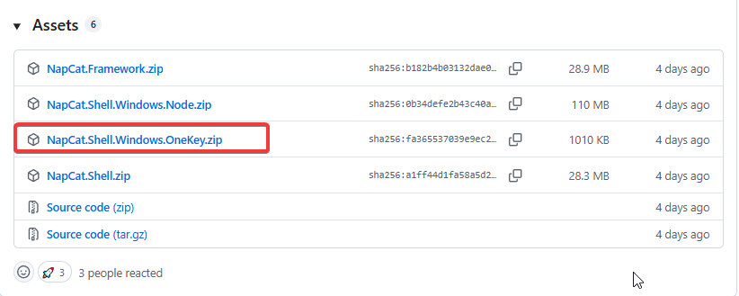

解压完成后，启动`NapCatInstaller.exe`

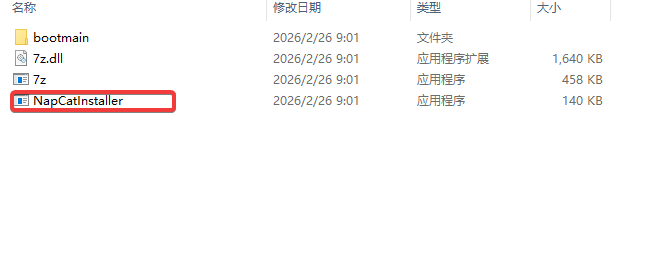

第一次启动可能被Windows Defender拦截，点击`更多信息` -> `仍要运行`

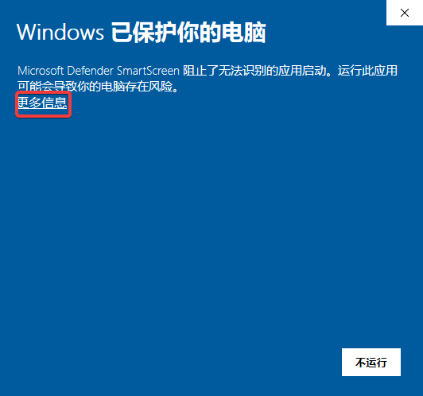

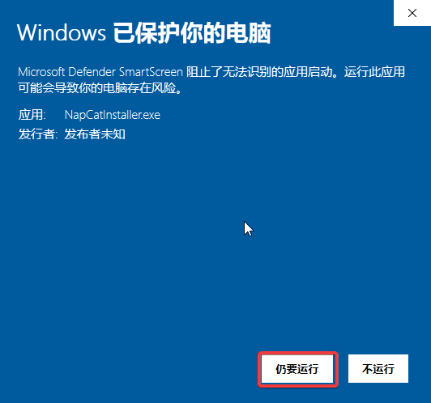

启动后会自动安装 Napcat 等待安装完成

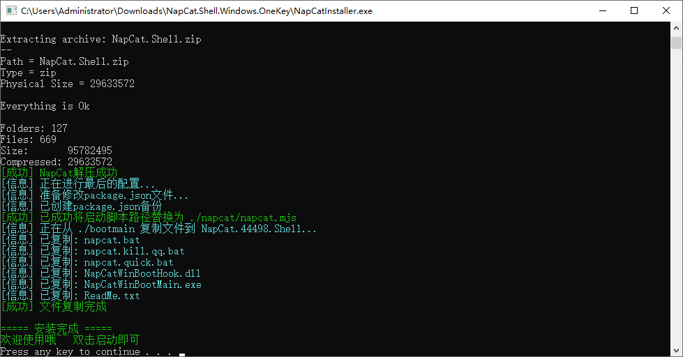

安装后会出现以`Shell`结尾的文件夹，打开文件夹里的`napcat.bat`来启动

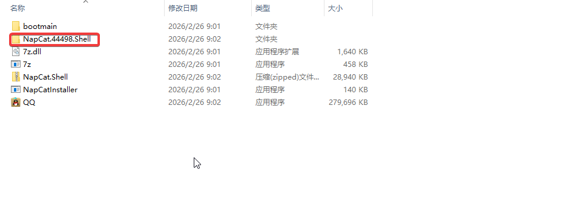


同样，启动时可能会提示安全警报，直接`运行`

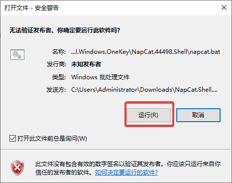

启动后会弹出登陆QQ的二维码，使用需要作为bot账号的QQ扫描登录，如果二维码不可扫，将图上红色框内的路径复制到文件管理器路径可以打开二维码

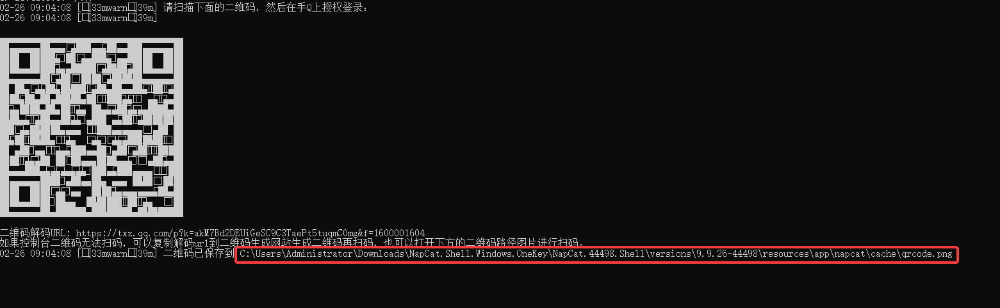

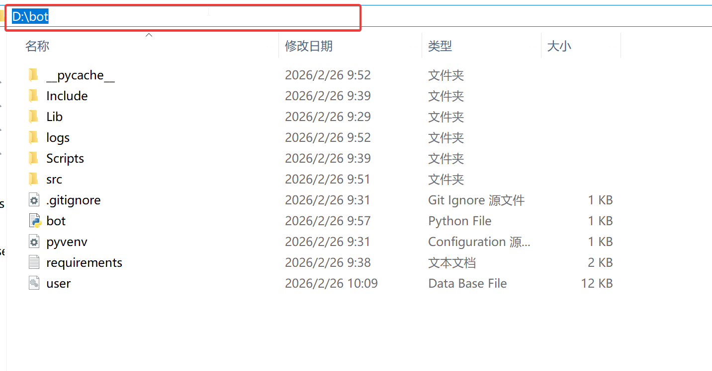

当登入成功后，终端会跳出最近的聊天信息


## 机器人部署

### 安装Python

前往[ Python 官网 ](https://www.python.org/downloads/windows/) 选择 `Downloads`-> `Python 3.x.x`

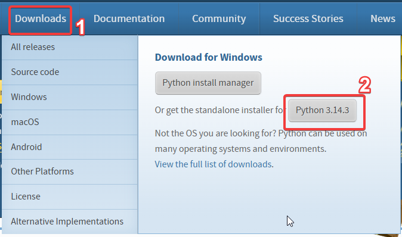

启动安装程序，勾选`Add Python to PATH`，点击`Install Now`

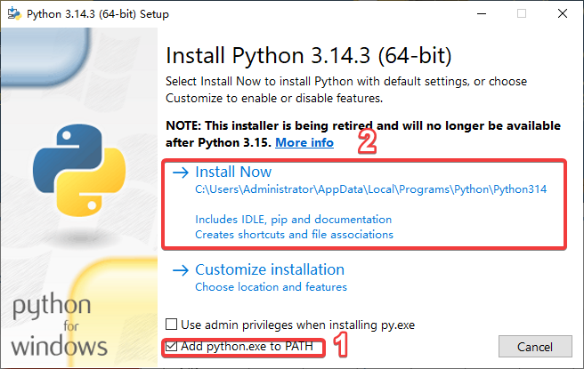

### 创建虚拟环境（可选）

使用搜索功能，搜索`cmd`，打开命令提示符，输入如图命令创建虚拟环境

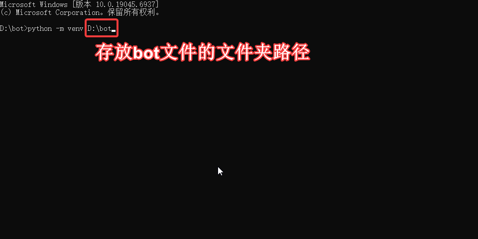

创建完成后，按照如图查找activate.bat，将路径复制到命令提示符中，激活虚拟环境

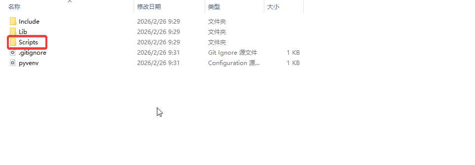

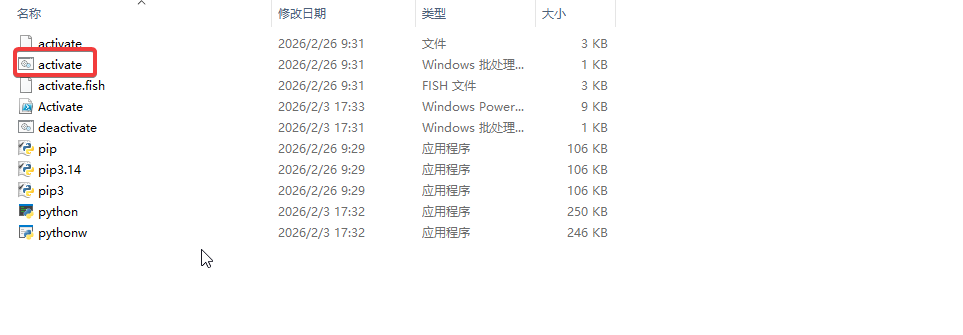

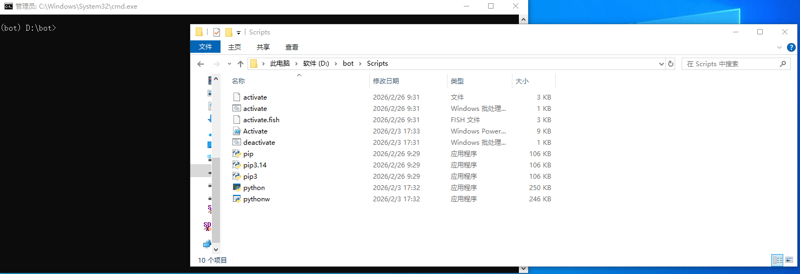

### 安装插件

将[插件仓库](https://github.com/PomeloNetwork/pomelo-pjsk-plugins)下载zip包解压到bot目录

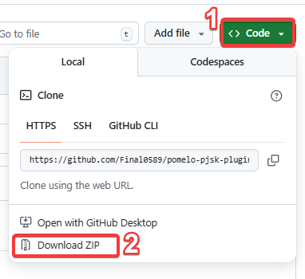

在上步激活的虚拟环境中（若无可跳过），进入插件目录，安装requirements.txt中的依赖

```
pip install -r requirements.txt
```

安装成功如下显示

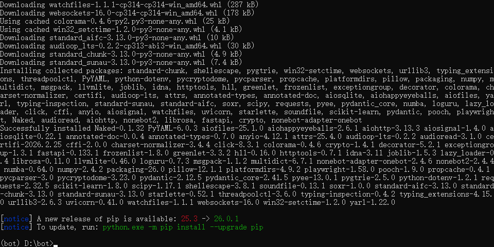

### 启动机器人并连接到Napcat

每次打开Napcat时，找到如图的WebUi地址，复制到浏览器打开，如果不是使用内网地址，请将地址中的`127.0.0.1`替换为其他地址

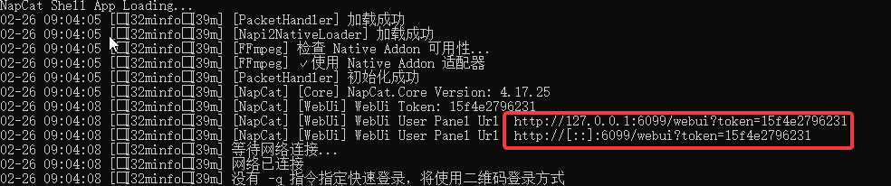

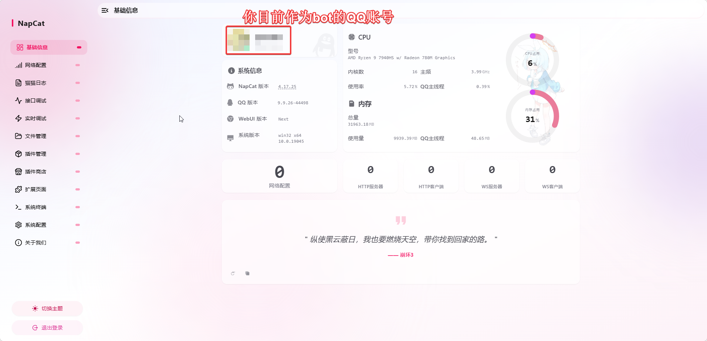

打开`.env`文件，将`SUPERUSER`的值填为管理员QQ号

修改完成后输入启动命令启动机器人

```
python bot.py
```

当正常启动并出现插件读取时则部署成功，这时记下`Unicorn running on`下的url

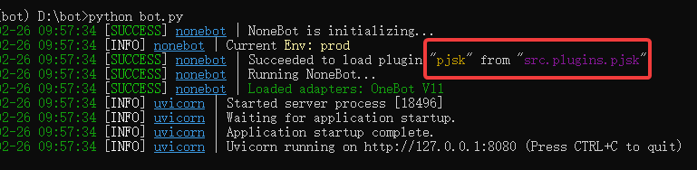

回到Napcat，点击`网络配置`->`新建`->`Websocket客户端`，将url地址前http替换为ws，增加`/onebot/v11/ws`，粘贴到`URL`中，`启用`后点击`保存`

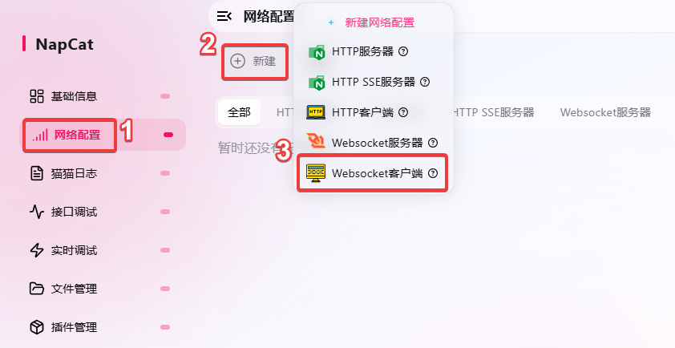

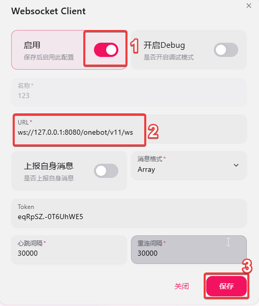

当机器人控制台出现`Unicorn connection open`即为部署成功

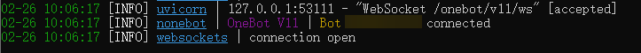

